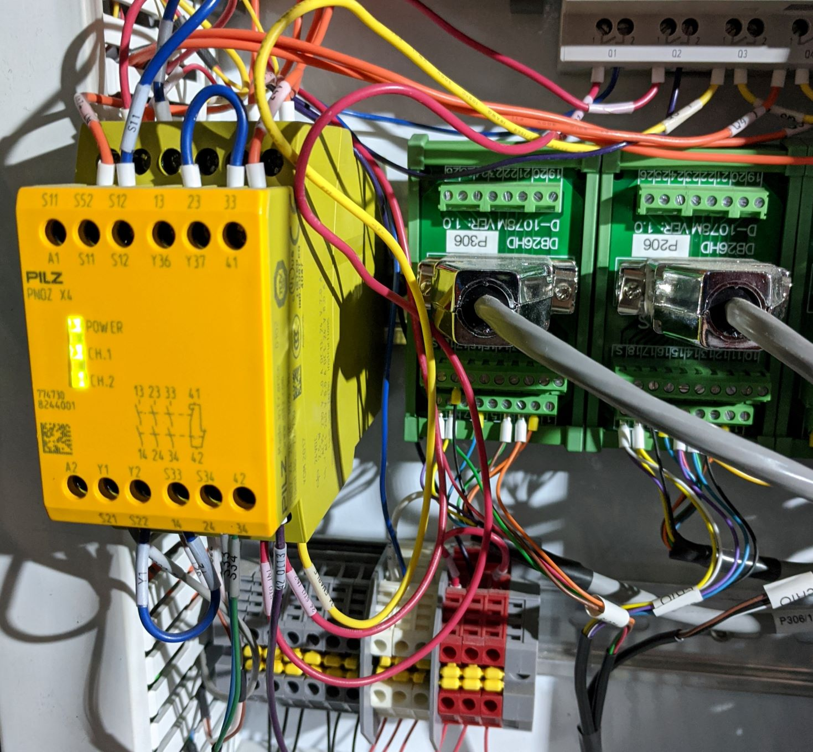

:tocdepth: 1

.. Please do not modify tocdepth; will be fixed when a new Sphinx theme is shipped.

.. sectnum::

.. note::

   This document describes general procedures to conduct manual observations with
   the Rubin Observatory Auxiliary Telescope. These procedures are influx and will evolve
   over time as the system matures, therefore it is highly recommended that users keep a
   close look on this document before doing any observations. Here we will also document
   troubleshooting to commonly found issues. In case of questions contact the document authors.

Introduction
============

It is important to emphasize that this document focus on early operations of the Auxiliary
Telescope, with a significant part of the hardware and software still in need of considerable
advancements. For instance, we are still in the process of obtaining and validating the
telescope pointing model and optical alignment.

There is also some significant distinctions in the way we operate the telescope at this early
stages and the way we plan to operate during commissioning and, even more, during normal
operations. At this point we maintain a "low-level" kind of operations, both due to the need
to be in full control of all the components and simply because the lack of high level
operation software available. In fact, we are in the process of developing high level software
that will improve considerably the user experience as well as pave the way for the development of
"SAL Scripts" that ultimately will power the observatory
`Script Queue <https://ts-scriptqueue.lsst.io>`_.

Furthermore, some issues
pointed in this document may have been corrected in the meantime so it is very likely
that the document will contain some outdated information. We will make an effort to document
corrections as they occur but be aware that changes may happen faster then we are able to update
this document. Users may want to check for more updated versions in the edition navigation page or
check the `github repository <https://github.com/lsst-tstn/tstn-004>`_ for any pending pull
requests.

.. _net-arch:

Network architecture and connectivity
=====================================

From the user perspective, the summit network can broken down into two main systems; the campus
and the control network. In principle, if you are at the summit, the base or in Tucson, if you are
connected to the LSST network (e.g. LSST-WAP) you will have access to the summit network and the
control network. IT managed to overlay both networks so that there is no need to use bastion
hosts to access systems on the control network from LSST network. This considerably simplify
user access to resources avoiding the need for ssh tunnels.

A list of the host computers IP address can be found
`here <https://confluence.lsstcorp.org/x/qw6SBg>`_.

.. _tools:

Monitoring and Interactive tools
================================

Here is a list of currently available tools to monitor and interact with the system and a quick
overview of how to use them. More details on how to perform specific tasks with the telescope
are described :ref:`furthermore <ops>`.

.. _efd:

Engineering and Facility Database (EFD)
---------------------------------------

The EFD is responsible for listening to and storing all data (Telemetry, Event, Commands and
Acknowledgements) sent by components and users interacting with the components. The most recent
incarnation of the EFD uses influxDB to store the data in a time-series database.
See `sqr-034 <https://sqr-034.lsst.io>`_ for details about the EFD implementation.

Data from the summit is available on chronograf and can be accessed at
`<https://chronograf-summit-efd.lsst.codes/>`_.

On the left hand side of the web page there is a tab with links to the different actions one can
perform with chronograf. Probably the two most useful tabs are ``Dashboards`` and
``Explore``; the first will take you to a list of available dashboards created by users that
gathers important information about the subsystems. The "Summary state monitor" is a good
example of general information one would be interested in during an observing night.

.. important::
    The chronograf dashboards are shared between all users. If you feel like you need
    to make any change to the already existing dashboards, make sure to create a copy
    of the one you plan on editing and change that one instead.

The ``Explore`` tab let users perform free hand queries to the database using a sql-like
language.

In addition to the chronograf interface, users can also query for EFD data from Python using
the `efd-client <https://efd-client.lsst.io>`_ library.

.. _jupyter:

Jupyter Lab Servers
-------------------

Jupyter notebooks are very popular amongst astronomers, specially in the LSST collaboration.
They provide an easy and simple way of running Python code interactively through a
web browser and give the additional benefit of combining documentation (using markdown language)
and code. Users can run Jupyter notebook server locally on their own machine or on servers,
enabling a cloud-like environment with access to powerful computing or, in the case of
the LSST control system, to specialized functionality.

The most recent incarnation of Jupyter notebooks is Jupyter Labs. It provides access to a similar
environment as that of a notebooks but with additional functionality.

We envision that Jupyter Lab servers will be a fundamental part of LSST control system,
enabling users to perform low and high level operations in a well-known and
interactive environment.

The current system deployment uses individual Jupyter Lab servers for each user running out of
individual docker containers. In the nearby future, the plan is to start using DM LSP
(:cite:`LDM-542`) environment to manage user servers and environment.

Each user receives an web address and token for an individual notebook server. With that
information it is a matter of opening the address on a browser and entering the token
in the login page. Once the logged in, the user should see the
:ref:`jupyter lab interface <fig-jupyter-interface>`.

.. figure:: /_static/jupyter_interface.jpg
   :name: fig-jupyter-interface
   :target: ../_images/jupyter_interface.jpg
   :alt: Jupyter interface

In the left hand there is a file browser navigation screen which, by default, have three directories;
:file:`develop`, :file:`repos` and :file:`shared`. The :file:`develop` directory is a bind mount on
the server that
runs the Jupyter Lab containers. Inside there is a repository for notebooks
(:file:`develop/ts_notebooks`) with examples and work notebooks from other users (separated by
username). Feel free to browse and edit any notebook within this repo. Be sure to commit and push
any work you may have done and eventually make Pull Request to the original repo so other users can
see and use work that was done.

While each user has their only :file:`develop` space, the containers have a shared mount space
visible to all users, :file:`shared`. Filed placed or edited here by a user in their jupyter server
will be available/modified to all the other users.

The :file:`repos` directory, on the other hand, contains some basic repos that ships with the
notebook server containing the T&S software used to power the control system. Any data in
this directory,
or in the home folder, will be lost if the container is restarted. It is advisable to only keep
important data inside the user designated folder (e.g. :file:`develop`).

It is also possible to access data taken with the LATISS instrument in the notebook server.
The data is immediately available in a butler instance in
:file:`/mnt/dmcs/oods_butler_repo/repo/`. This mount point is read-only by all users but
inside that there are a couple of shared mount places for users to save calibration
and reduced data (:file:`/mnt/dmcs/oods_butler_repo/repo/CALIB` and
:file:`/mnt/dmcs/oods_butler_repo/repo/rerun`).

.. _love:

LSST Operations and Visualization Environment (LOVE)
----------------------------------------------------

The LOVE interface is available at the summit on the following address;
`<http://amor01.cp.lsst.org>`_. In general, the interface will be visible in the
observing room at the Summit and in Tucson. The current list of available views
is influx, an example is shown bellow.

.. figure:: /_static/love-1.jpg
   :name: fig-love-1
   :target: ../_images/love-1.jpg
   :alt: LOVE home web page with links to available views.

.. image:: /_static/love-2.jpg
   :name: fig-love-2
   :target: ../_images/love-2.jpg
   :scale: 50 %
   :alt: LOVE summary state view.

.. _queue:

Script Queue
------------

.. note::
    TBD

.. _csc:

Auxiliary Telescope Commandable SAL Components (CSCs)
=====================================================

:ref:`This diagram <fig-attcs>` shows all the CSCs (light blue boxes) that are currently being
used at the summit, their connections, the users jupyter servers and the salkafka producer that is
responsible for capturing all SAL traffic, serialize it in avro an send it over to kafka to be
inserted on the influx database (see `sqr-034 <https://sqr-034.lsst.io>`_ for more information
about the EFD).

.. figure:: /_static/ATTCS-2.jpg
   :name: fig-attcs
   :target: ../_images/ATTCS-2.jpg
   :alt: AuxTel components

These components are grouped into high-level components that, although independent,
work together logically. In the case of AT, these are the Auxiliary Telescope -
Telescope Control System (ATTCS) and the LSST Auxiliary Telescope Image and
Slit less Spectrograph (LATISS).

.. _ops:

Basic Operations Procedures
===========================

This section explains how one can perform basic operations with the telescope using the
Jupyter Lab server.

.. note::
    Notebooks with the procedures can be found on the :file:`develop/ts_notebooks/examples`
    folder.

.. _startup:

Startup procedure
-----------------

At the end of the day, before observations starts, most CSCs will be unconfigured and
in ``STANDBY`` state. The first step in starting up the system is to enable all CSCs.
Putting a CSC in the ``ENABLED`` state requires the transition from ``STANDBY`` to
``DISABLED`` and then from ``DISABLED`` to ``ENABLED``. When transitioning from
``STANDBY`` to ``DISABLED`` it is possible to provide a ``settingsToApply`` that selects
a configuration for the CSC. Some CSCs won't need any settings while others will.
It is possible to check what are the available settings by looking at the ``settingVersions``
event. Alternatively, it is also possible to let the high level control scripts to
decide which configuration to use. In most cases, when performing regular operations,
the auto-selection algorithm should be used.

To get started with it, make sure to open jupyter lab, navigate to the
`~/develop/ts_notebooks/` folder nad create a directory with your username in that
repository (e.g. `tribeiro` or `pingraham`). Then, navigate inside the newly
created directory and create sub-directories as you see fit to keep the notebooks
organized. Once you are happy with the location you selected for the nights operation
start a clean notebook and enter the following to import the basic libraries.

::

    import asyncio

    from lsst.ts import salobj

    from lsst.ts.standardscripts.auxtel.attcs import ATTCS
    from lsst.ts.standardscripts.auxtel.latiss import LATISS

In the above, ``salobj`` is the high-level library that we use for basic
communication on component base. The following classes, ``ATTCS`` and ``LATISS``
are developed using ``salobj`` to enable high-level operations combining multiple
components. The components involved in each of these high level classes are depicted
in :ref:`the component diagram <fig-attcs>` above.

It is possible now to use those classes to operate with the components. To enable
them run;

::

    domain = salobj.Domain()
    attcs = ATTCS(domain)
    latiss = LATISS(domain)

    await asyncio.gather(attcs.start_task, latiss.start_task)

    await attcs.enable()

    await latiss.enable()

In case you want to enable the components with custom settings, it is possible to
pass them as a dictionary, e.g.;

::

    await attcs.enable(settings={
                    'ataos': "current",
                    'atmcs': "",
                    'atptg': "",
                    'atpneumatics': "",
                    'athexapod': "current",
                    'atdome': "test.yaml",
                    'atdometrajectory': ""})

To prepare for the afternoon calibrations, run the high-level task.

::

    await attcs.prepare_for_flatfield()

This method will position the dome and telescope to the appropriate position for taking
flat field data, open the mirror covers and all set up all other components to their
correct state. The ``LATISS`` class then offers high level tasks to acquire calibration
data.

::

    bias_data_id_list = await latiss.take_bias(nbias=10)

    dark_data_id_list = await latiss.take_darks(exptime=100., ndarks=10)

    flat_data_id_list = await latiss.take_flats(exptime=5., nflats=10,
                                                filter='blank_bk7_wg05',
                                                grating='ronchi90lpmm')

Each method will return a list of `data_id` that allows users to access the
data on a butler instance. We will give more details :ref:`furthermore <latiss>`.

Once the calibrations are done and you are ready to open the telescope for the night,
you can run;

::

    await attcs.startup()

It is safe to run this method with the telescope in most states. The task
will make sure to verify that all CSCs are in their proper state, will close the mirror
covers before opening the dome and then proceed to open the dome and so on.

.. _pointing:

Pointing
--------

The action of pointing and start tracking involves sending a command to the pointing component
(``ATPtg``) and then waiting for the telescope and dome to be in position while making sure
:ref:`all components <fig-attcs>` remain in ``ENABLED`` state.

When using the ``ATTCS`` class it is possible to perform the task with the following set of
commands:

::

    import asyncio

    import astropy.units as u
    from astropy.time import Time
    from astropy.coordinates import ICRS, Angle

    from lsst.ts.standardscripts.auxtel.attcs import ATTCS

Initializing ``ATTCS`` class.

::

    attcs = ATTCS()
    await attcs.start_task

Run the slew task. This task will only finish when the telescope and the dome are
positioned. Also, this will set the sky position angle (angle between y-axis and North) to
be zero (or 180. if zero is not achievable). It is possible to use RA/Dec and rotator
as hexagesimal strings or floats (and mix and match them). For instance,

::

    await attcs.slew_icrs(ra="20:25:38.85705", dec="-56:44:06.3230", sky_pos=0., target_name="Alf Pav")

or 

::

    await attcs.slew_icrs(ra=20.42746, dec=-56.73508, sky_pos=0., target_name="Alf Pav")

It is also possible to slew to an RA/Dec target and request a rotator position. To do that use the
``rot_pos`` argument instead of ``sky_pos``. Note that this will request ``rot_pos`` at the
requested time, which will change as the telescope track the object.

::

    await attcs.slew_icrs(ra="20:25:38.85705", dec="-56:44:06.3230", rot_pos=0., target_name="Alf Pav")

Note that this task still experience some undesired behaviour, like hanging in until it times out
or returning before the end of a slew. These issues are mainly due to issues with the `ATMCS`
either because it still fails to comply with our system architecture (like sending events in
specific order) or due to issues with the internal control algorithms.

The `ATTCS` class provides a couple different ways to execute offsets with the telescope; offsets
in Az/El, RA/Dec and xy. These can be done with the following calls, respectively
(all values are in `arcsec`);

::

    await attcs.offset_azel(az=100., el=100.)

    await attcs.offset_radec(az=100., el=100.)

    await attcs.offset_xy(az=100., el=100.)

The offsets are not cumulative meaning, if you execute the same command more than once, you
get the same offset, e.g.;

::

    await attcs.offset_azel(az=100., el=100.)
    await attcs.offset_azel(az=100., el=100.)

is equivalent to

::

    await attcs.offset_azel(az=100., el=100.)

.. _latiss:

Using the LSST Auxiliary Telescope Image and Slit less Spectrograph (LATISS)
----------------------------------------------------------------------------

Similarly to `ATTCS`, the `LATISS` class allow users to interact with the
instrument in a seamless way, without the need to worry about most of the
multiple components that form the instrument. It also makes an effort to
facilitate data acquisition so users don't have to worry about some
details required by the system (like setting of specific values in commands).

We already went through the tasks available to acquire calibration data
:ref:`above <startup>`. Let us now review the task to take object and
engineering data and then how to access the data using the butler.

As with the calibration tasks, one can use the `take_object` and `take_engtest`
tasks to get object and engineering test data respectively. These tasks are
similar to that of `take_flats` where the user can specify a filter and grating
in addition to an exposure time and number of exposures, e.g.;

::

    object_data_id_list = await latiss.take_object(exptime=5., n=10,
                                                   filter="blank_bk7_wg05",
                                                   grating="ronchi90lpmm",
                                                   object="Alf Vel")

    engtst_data_id_list = await latiss.take_engtest(exptime=5., n=10,
                                                    filter="blank_bk7_wg05",
                                                    grating="empty_1",
                                                    object="Alf Vel - test")

Again, the method will return a list of data ids that can be used to access
the data on the butler.

::

    from lsst.ip.isr.isrTask import IsrTask

    import lsst.daf.persistence as dafPersist

    dataPath = '/mnt/dmcs/oods_butler_repo/repo/'
    butler = dafPersist.Butler(dataPath)

    data_ref = butler.dataRef('raw', **dict(visit=object_data_id_list[0]))

    exposure = isrTask.runDataRef(data_ref).exposure

.. _liveview:

Using GenericCamera Liveview
----------------------------

The GenericCamera liveview mode can be used for quick look of telescope pointing, to check
that a target is centered on the field after a slew was performed or to quickly evaluate the
optics. When liveview mode is activated, the GenericCamera CSC will start a web server and
start streaming the images taken with the selected exposure time. To visualize the images streamed
by the CSC we created a separate web server that connects to the CSC stream and display the images.
This is illustrated in the following :ref:`diagram <fig-liveview>`.

.. figure:: /_static/LiveView.jpg
   :name: fig-liveview
   :target: ../_images/LiveView.jpg
   :alt: AuxTel components

This is how to start live view in the GenericCamera;

::

    from lsst.ts import salobj
    import asyncio

::

    d = salobj.Domain()

::

    r = salobj.Remote(d, "GenericCamera", 1)

::

    await r.start_task

Before starting live view, make sure to enable the CSC with the 4x4 binning settings.

::

    await salobj.set_summary_state(r, salobj.State.ENABLED, settingsToApply="zwo_4x4.yaml")

When starting live view mode the user must specify the exposure time, which also sets the frame
rate of the stream. So far, we have tested this with up to 0.25s exposure times.

::

    await r.cmd_startLiveView.set_start(expTime=0.5)

Once live view has started, make sure you have the :ref:`live view ssh rule running <chile-wget>`,
then you should be able to access the live view server by opening ``localhost:8881`` on a
browser.

.. attention::
    The web server that streams the live view data is not in a stable state. If the browser is not
    loading the page you may have to check the process running the live view server and restart
    it. Check the :ref:`issues` session for more information about how to restart it.

To stop live view, you just need to run the following command.

::

    await r.cmd_stopLiveView.start(timeout=10)

.. _take-image:

Using GenericCamera to take (fits) images
-----------------------------------------

The GenericCamera CSC was designed to emulate the same behaviour as that of the
ATCamera and MTCamera CSCs. That means the commands and events have the same name and,
as much as possible, the same payload and the events marking the different stages of
image acquisition are also published at approximately the same stages.

To take an image with the GenericCamera first make sure that live view is not running. If
live view is running the take image command will be rejected. Then, to take an image:

::

    r.evt_endReadout.flush()
    await r.cmd_takeImages.set_start(numImages=1,
                                     expTime=10.,
                                     shutter=True,
                                     imageSequenceName='alf_pav'
                                    )

    end_readout = await r.evt_endReadout.next(flush=False, timeout=5.)

    print(end_readout.imageName)

You can download the image on your notebook server using the following command;

::

    import wget
    filename = wget.download(f"http://192.168.1.216:8000/{end_readout.imageName}.fits")

Note that this only works from the Jupyter notebook server as it is connected to the control
network.

You can download the image produced by the command above on your local computer
by running the following ``wget`` on the command line (make sure the
:ref:`chile-wget ssh rule is running <chile-wget>`).

.. prompt:: bash

   wget http://localhost:8001/<image_name>

.. _issues:

Troubleshooting
===============

Here we describe some of the currently known issues and how to resolve them.

.. _issue-atmcs:

ATMCS won't get out of FAULT State
----------------------------------

.. note::

    This issue has been resolved as far as we know. But, we'll keep the issue
    and solution here in case it resurfaces.

In some situations the ATMCS will go to ``FAULT`` state and it will reject the ``standby`` command,
preventing to recover the system. We have been working on tracking this issue down but,
should you encounter this issue it is possible to recover by pressing the e-stop button on
the main cabinet (close to the telescope pier) and on the dome cabinet (east building wall on lower
level) and then executing the :ref:`E-stop reset procedure <estop_reset>`. This should clear the ``FAULT`` state and leave the ATMCS in ``STANDBY``.

.. _issue-liveview:

Live view server is not responding
----------------------------------

.. note::

    This issue has been considerably mitigated and the live view server will be replaced soon
    by a view in the LOVE interface.

The :ref:`live view server <fig-liveview>` that is responsible for receiving images from the
GenericCamera and streaming it to a user web browser is still in a very rough shape. The server
connect to the GenericCamera over a TCP/IP socket and provides an image streaming server using a
simple tornado web server. The connector that is responsible for receiving images from the
CSC is still not capable of handling a dropped connection. That means, if there is a connection
issue it is not capable of regenerating and continuing operations. Moreover, if the liveview
mode is switched off on the CSC, the connection is also dropped and the live view server is also
not capable of reconnecting.

If any of this happens the easiest solution is to restart the live view server. For that, you
will need to connect to the container running the liveview server, kill the running procedure and
restarting the process. This can be summarized as follows;

.. prompt:: bash

    ssh liveview-host
    docker attach gencam_lv_server
    python liveview_server.py

Once the live view server is running you can detach from the container by doing ``Crtl+p Crtl+q``.

.. _build-idl:

Building CSC interfaces
-----------------------

.. note::

    The latest notebook servers ships with the interfaces for all available components.
    These instructions are still useful in case you need to update the interface
    on the fly.

To communicate with a CSC, we use a class provided by ``salobj`` called ``Remote``.
As you can see on previous sessions, the ``Remote`` receives the name of the CSC as
an argument, which ultimately, specifies the interface to load.

In order for the ``Remote`` to load this interface it needs to have the set of
idl libraries available. In some cases, the interface for the CSC that you plan
on communicating may no be readily available on the Jupyter notebook server. If
this is the case you will see an exception like the following when trying to
create the ``Remote``.

::

    ---------------------------------------------------------------------------
    RuntimeError                              Traceback (most recent call last)
    <ipython-input-2-470a83f93eee> in <module>
    ----> 1 r = salobj.Remote(salobj.Domain(), "Component")

    ~/repos/ts_salobj/python/lsst/ts/salobj/remote.py in __init__(self, domain, name, index, readonly, include, exclude, evt_max_history, tel_max_history, start)
        137             raise TypeError(f"domain {domain!r} must be an lsst.ts.salobj.Domain")
        138
    --> 139         salinfo = SalInfo(domain=domain, name=name, index=index)
        140         self.salinfo = salinfo
        141

    ~/repos/ts_salobj/python/lsst/ts/salobj/sal_info.py in __init__(self, domain, name, index)
        152         self.idl_loc = domain.idl_dir / f"sal_revCoded_{self.name}.idl"
        153         if not self.idl_loc.is_file():
    --> 154             raise RuntimeError(f"Cannot find IDL file {self.idl_loc} for name={self.name!r}")
        155         self.parse_idl()
        156         self.ackcmd_type = ddsutil.get_dds_classes_from_idl(self.idl_loc, f"{self.name}::ackcmd")

    RuntimeError: Cannot find IDL file /home/saluser/repos/ts_idl/idl/sal_revCoded_Component.idl for name='Component'

But, instead of ``Component`` it will be the name of the CSC you tried to connect to.
To resolve this issue, you will need to build the libraries. You can do that by putting the
following commands on a notebook cell:

::

    %%script bash
    make_idl_files.py <Component>

Again, you will need to replace ``<Component>`` by the name of the CSC.

.. _advanced_ops:

Advanced Operations Procedures
==============================

This section explains advanced procedures which may be required, specifically
during commissioning or during servicing.

.. _estop_reset:

E-stop Reset Procedure
----------------------

If an E-stop has been activated (or possibly an L3 limit switch hit) then the
following procedure must be followed to free the system. i

#. Remove the issue that caused the E-stop to be activated. 
#. Activate both E-stops, the one on the telescope control cabinet, and the one
   on the dome control cabinet. Both will glow red.
#. Release dome E-stop by turning clockwise a quarter turn or so
#. Release main cabinet E-stop in the same manner
#. Press the blue start button on the dome cabinet
#. Press the blue start putton on the telescope control cabinet

If this is done correctly, all three LEDs on the Pilz devices in both cabinets
should be brightly illuminated, as seen in the following image. If only the
main cabinet is depressed, then only the top light is bright. If only the dome
cabinet is pressed, the top and bottom lights are bright.

   The Pilz controller in the Telescope Cabinet. All three lights illuminated
       means the E-stops are properly deactivated.

Note that if both E-stops are never activated simultaneously then the system
will not reset.

.. note::
        All L3 limit switches and E-stops are run through the smart relay
        system. This means that if an L3 limit (which is a hardstop at the
        extreme end of travel of the elevation, azimuth, M3 rotator and
        nasmyth axes) is contacted, then it will look as if an E-stop was
        pressed. To identify which L3 limit was hit, one must examine the
        interface of the smart relay. Any active signal will not have a filled
        box around the central number. The central number is then mapped to a
        L3 using the Auxiliary Telescope Electrical Diagram (Document-26731)

.. _atmcs_gui:

Viewing the ATMCS LabVIEW GUI
------------------------------

This is the GUI developed by Rolando Cantarutti and Omar Estay to display and
interact with the telescope mount at a low-level (directly from the cRIO with
no SAL communication). This is not meant to be used for regular operations.

Connections can currently be accomplished in two ways, the first uses a VNC
connection to a windows machine currently located in the AuxTel building. The
second is to login remotely using the LabVIEW Connector (requires Internet
Explorer and a specific driver).

#. Using RealVNC (which is required due to encryption although other clients
    might work) connect to 'atmcs-dev.cp.lsst.org' on port 5900
#. Enter credentials (ask Patrick or Tiago)
#. If the GUI is not already open, then open internet explorer and enter the
    following address in the address bar.
   
   .. code-block:: python 
        
	http://atmcs-crio.cp.lsst.org:8000/atmcs.html

One can also install the `LabVIEW remote panel <http://ftp.ni.com/support/softlib/labview/labview_runtime/2010/2010Sp1%20Linux%20Temp/labview-2010-rte-10.0.1-1.i386.zip>`_
on their Windows machine (Internet Explorer only) then open a tunnel to the
above IP on port 8000. This requires the download from NI. Details will be
included in the ATMCS documentation upon delivery. We don't recommend this
method unless absolutely necessary.

.. _hexapod_connection_reset:

Resetting the ATHexapod IP Connection
-------------------------------------

For reasons which are under investigation, occasionally after a power cycle
(we think) the hexapod TCP/IP connection goes down. To reset it, one must
connect a serial port to the device, establish a connection using the (windows)
PIMikroMove software, close the connection, then power cycle the controller.
Power cycling can be done remotely (:ref:`using the switched PDU
<telescope_cabinet_pdu>`). Until this problem is resolved, we've left a
permanent serial (RS-232) connection to a local windows machine.

Follow these steps to re-establish TCP/IP connection:

#. Establish VNC connection :ref:`which is the same as the ATMCS GUI VNC shown here <atmcs_gui>`.
#. Open PIMikroMove software from start menu
#. Open new connection and select C-887 controller, and click connect
#. Close connection
#. Power cycle controller (which will cause the hexapod to lose the reference
    position)
#. Put hexapod CSC in enabled state (which will send the hexapod to the
    reference position)
#. Move hexapod to desired position

.. _mitutoyo_and_copley_connections:

Mitutoyo Micrometers and Copley Controller Connections
-------------------------------------------------------
The mitutoyo devices (when connected) are currently controlled through the
Copley PC (located in the bottom of the telescope cabinet). Connection to this
Windows machine uses TeamViewer. Contact Patrick for credentials.

More details to follow.

.. _telescope_cabinet_pdu:

Telescope Cabinet Switchable PDU
--------------------------------

In the event that a controller in the cabinet needs power cycling remotely,
this may be done by logging into the switchable PDU mounted in the cabinet.
The IP and connection info can be found `here <https://confluence.lsstcorp.org/x/qw6SBg>`_

* Channel 1 is connected to the main 24V supply. This will power off the cRIO
(and possibly the Copley controllers, Pilz Device, and Smart Relay).
* Channel 2 is connected to powerbar in bottom of cabinet, which has the 220V
connection to the mount (which powers the Embedded PC for the Collimation
Camera) as well as the hexapod connected to it.

.. _atdome_communication_loss:

AT Dome Communication Loss
--------------------------
If during operation the dome controllers lose connection, which is seen either
from the software, or the push-buttons fail to work, then this procedure must
be followed. The dome has two types of communication failsures

* The two cRIOs lose communication with each other (notably the cRIO in the
rotating part of the enclosure loses connection with the bottom box and may be
blocking the connection). If the CSC is connected and in disabled or enabled
state, then this will be shown in the `scbLink` event (must verify). Also, t
his can be seen in the Main Box Dome Control LabVIEW Remote on the ATMCS
machine as the `TopComms` light in the bottom left corner.

  * Press the reset button on the cRIO inside the electrical cabinet on the
    rotating part of the dome (near the lower shutter) to resolve this issue

* The Main cRIO (located in the dome electrical cabinet on the first floor) is
  not correctly releasing the TCP/IP connection. This can be observed by being
  able to ping the box but not open a telnet connection (port 17310). Also,
  the HostComms light will be illuminated in the Main Box Dome Control LabVIEW
  remote.
 
  * Press the reset button on the cRIO in the dome cabinet on the first floor
  to resolve this issue

.. Add content here.
.. Do not include the document title (it's automatically added from metadata.yaml).

.. .. rubric:: References

.. Make in-text citations with: :cite:`bibkey`.

.. bibliography:: local.bib lsstbib/books.bib lsstbib/lsst.bib lsstbib/lsst-dm.bib lsstbib/refs.bib lsstbib/refs_ads.bib
    :style: lsst_aa
